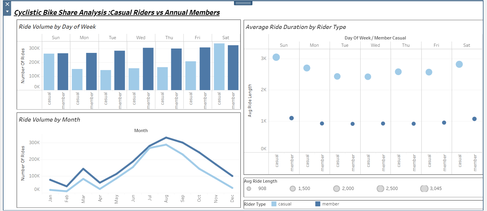

# Cyclistic Bike Share Analysis 🚴‍♂️

## 📌 Project Overview

This project analyzes how casual riders and annual members use Cyclistic bike-share services differently. The goal is to identify behavioral patterns that can help convert casual riders into long-term members.

---

## 🎯 Business Task

Cyclistic aims to increase the number of annual memberships.
This analysis focuses on understanding the differences in usage between casual riders and members to support data-driven marketing strategies.

---

## 🛠️ Tools Used

* R (data cleaning & analysis)
* Tableau (data visualization)
* Kaggle (data processing & notebook)
* GitHub (project documentation)

---

## 📊 Dataset

The dataset contains 12 months of historical bike trip data (April 2020 – March 2021).

🔗 (https://www.kaggle.com/code/shreyabhingradiya/cyclistic-bike-share-analysis)
---

## 📈 Dashboard

🔗 **Interactive Dashboard:** https://public.tableau.com/app/profile/shreya.bhingradiya/viz/CyclisticBikeShareAnalysis_17735852948000/Dashboard1

---

## 🔍 Key Insights

* Casual riders take longer rides compared to annual members.
* Casual riders are more active on weekends, while members ride consistently during weekdays.
* Casual riders show strong seasonal trends, with peak usage in summer.
* Members maintain steady usage throughout the year.

---

## 💡 Recommendations

1. Target casual riders during weekends and peak seasons.
2. Promote membership as a cost-effective and convenient option.
3. Use personalized digital campaigns to encourage conversion.

---

## 📂 Project Structure

cyclistic-bike-share-analysis/
│
├── README.md
├── Cyclistic_Bike_Share_Analysis.ipynb
│
├── visuals/
│   ├── dashboard.png
│   ├── ride_duration.png
│   ├── rides_by_day.png
│   └── rides_by_month.png

---

## 🚀 Author

Shreya Bhingradiya
Aspiring Data Analyst
